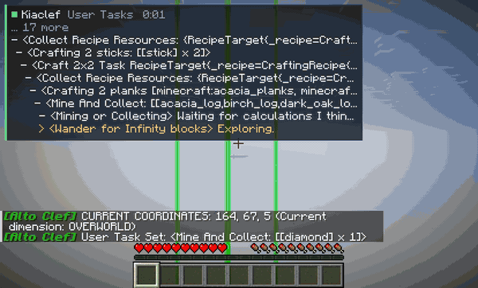
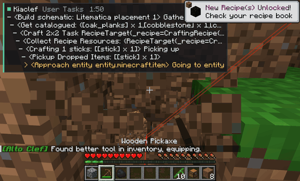
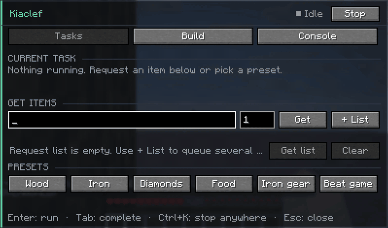
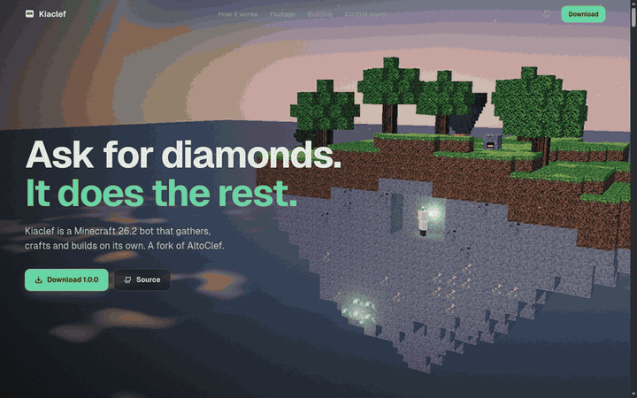

<p align="center">
  <a href="https://ran4om.github.io/kiaclef/"></a>
</p>

<h1 align="center">Kiaclef</h1>

<p align="center">
  <b>Ask for diamonds. It does the rest.</b><br>
  A Minecraft 26.2 bot that gathers, crafts and builds on its own.<br>
  A fork of <a href="https://github.com/gaucho-matrero/altoclef">AltoClef</a>.
</p>

<p align="center">
  <a href="https://github.com/ran4om/kiaclef/releases/latest"></a>
  
  
  <a href="LICENSE"></a>
</p>

<p align="center">
  <a href="https://ran4om.github.io/kiaclef/"><b>Website</b></a> &nbsp;·&nbsp;
  <a href="https://github.com/ran4om/kiaclef/releases/download/v1.0.0/kiaclef-1.0.0.jar"><b>Download 1.0.0</b></a> &nbsp;·&nbsp;
  <a href="usage.md">Commands</a> &nbsp;·&nbsp;
  <a href="INSTALL_26.2.md">Install and testing notes</a>
</p>

<br>

<p align="center">
  
</p>

## Watch it work

One `@get diamond` on a brand new world with an empty inventory. This is a real run, sped up: the HUD in the corner is Kiaclef's live task chain, and the timer stops at 3 minutes 33 seconds when the diamond lands.

<p align="center">
  
</p>

## Builds schematics, and keeps going when interrupted

Point it at a Litematica placement or a `.litematic`, `.schem` or `.schematic` file. It counts the materials, gathers and crafts what is missing, then places every block. In this run a skeleton's arrow interrupts the build: Mob Defense takes over to dodge, then the same build resumes and finishes.

<p align="center">
  
</p>

## Everything from one panel

Press **J** in-game. Request items with autocomplete, queue whole shopping lists, pick a schematic, or run any command with history. `Ctrl+K` stops everything.

<p align="center">
  
</p>

## The website

A scroll-driven 3D tour of everything above lives at **[ran4om.github.io/kiaclef](https://ran4om.github.io/kiaclef/)**.

<p align="center">
  <a href="https://ran4om.github.io/kiaclef/"></a>
</p>

## Install

1. Install [Fabric Loader](https://fabricmc.net/use/) **0.19.5+** for Minecraft **26.2**, with Java **25+**.
2. Put [Fabric API](https://modrinth.com/mod/fabric-api) **0.154.2+26.2** in your `mods` folder.
3. Download **[kiaclef-1.0.0.jar](https://github.com/ran4om/kiaclef/releases/download/v1.0.0/kiaclef-1.0.0.jar)** and put it in `mods`.
4. Optional, for `@build placement`: [Litematica](https://modrinth.com/mod/litematica) 0.28.8 and MaLiLib 0.29.6.

Baritone is bundled. Don't install a separate Baritone or AltoClef jar alongside it. Kiaclef keeps AltoClef's internal mod id, so its settings live in the same `altoclef/` folder.

SHA-256 of the 1.0.0 jar: `d20f06011e64072b9b8c65dba770561ed49373aee647d4710983dea4567157ec`

## Usage

Press **J** for the control panel, or type commands in chat with the `@` prefix:

```text
@get diamond 3
@get [chest 2, stick 16]
@list
@build myhouse.litematic
@build placement
@stop
```

All commands and settings are in [usage.md](usage.md).

## What's different from AltoClef

| | |
| --- | --- |
| **Minecraft 26.2** | Ported from 1.18.2 to 26.2 with Mojang mappings, Fabric Loader 0.19.5, Fabric API 0.154.2 and Baritone 1.19.0. |
| **Control panel and HUD** | An in-game panel (J) for tasks, item lists, schematics and commands, and a compact task HUD with elapsed time. |
| **Schematic building** | Litematica placements and schematic files, with materials gathered and crafted first, and resumption after interruptions. |
| **Fixes from real runs** | Container tracking under lag and double clicks, several crafting loops, leftover grid items, partial stack top-ups, and Baritone pausing over a carried chest. |

## Status and limits

Version 1.0.0 passes 1,383 unit tests and automated sessions in the packaged game on freshly generated worlds. Those sessions covered: diamond from an empty inventory on untouched terrain, item lists, Litematica building with mid-build recovery, chest loot, deposits, stashing and stacking, the kelp crafting chain, Mob Defense task selection, and the control panel.

Still rough:

- **Night survival is weak.** Mob Defense reacts late to creepers and Drowned, so long tasks in the open at night can end in death and lost items.
- **Not verified:** speedrunning (`@gamer`), Nether and End travel on natural terrain, real combat, multiplayer servers, large schematics, and most of the catalogue's items.

Bug reports are welcome in [Issues](https://github.com/ran4om/kiaclef/issues).

## Building from source

```sh
./gradlew build
```

This needs a Java 26 JDK for the Gradle toolchain; the mod targets Java 25. The jar is written to `build/libs/kiaclef-1.0.0.jar`. The website source is in [`site/`](site/).

## Credits and licenses

- **[AltoClef](https://github.com/gaucho-matrero/altoclef)**, © 2020 Adris Jautakas (TacoTechnica) and contributors, MIT License. Kiaclef is a modified version of it, released under the same [MIT License](LICENSE).
- **[Baritone](https://github.com/cabaletta/baritone)** 1.19.0 by leijurv, Brady and contributors, bundled unmodified, [LGPL-3.0](LICENSE-BARITONE).
- **Jackson** 2.20 and **Apache Commons Lang** 3.20.0, bundled, Apache License 2.0.
- The README banner and website key art were generated for this project. In-game footage and screenshots come from Kiaclef's automated test runs.

[THIRD_PARTY_NOTICES.md](THIRD_PARTY_NOTICES.md) lists every bundled and optional component. Kiaclef is not affiliated with Mojang or Microsoft, or with the AltoClef or Baritone projects.
